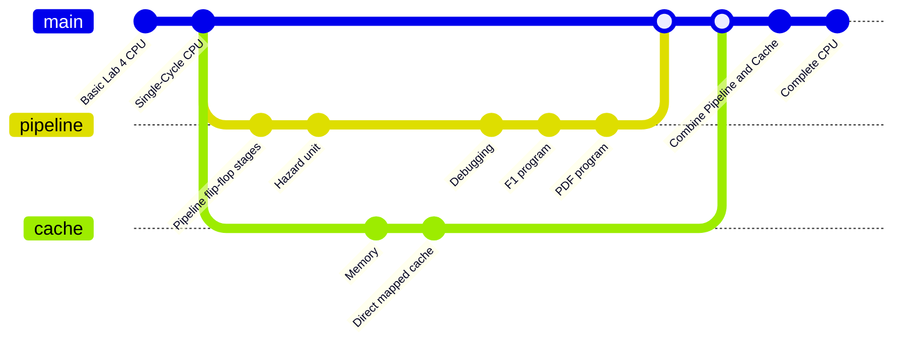

# RISC-V RV32I Processor

## Project Description
A RISC-V RV32I processor was implemented with cache and pipelining...

## Team #4 Members

| Athanase de Germay de Cirfontaine (repo manager) | Radaan Kumar Madhan| Ivy Yu | Will Zhang |
|-|-|-|-|

## Team Contribution

- Work Contribution Table
- `/` refers to **minor contribution**
- `X` refers to **major contribution**

| Steps        | Files                         |Radaan (RadaanMadhan)| Will (will03216) | Ivy (Ivy-yu7) | Athanase (Wazab-75)|
| ------------ | ----------------------------- | ------------------ | ---------------- | ------------------------ | ---------------- |
| Lab 4        | Program Counter               |                    |                  |                          |                  |
|              | ALU                           |                    |                  |                          |                  |
|              | Register File                 |                    |                  |                          |                  |
|              | Instruction Memory            |                    |                  |                          |                  |
|              | Control Unit                  |                    |                  |                          |                  |
|              | Sign Extend                   |                    |                  |                          |                  |
|              | Testbench                     |                    |                  |                          |                  |
| Single Cycle | Data Memory                   |                    |                  |                          |                  |
|              | Program Counter               |                    |                  |                          |                  |
|              | ALU                           |                    |                  |                          |                  |
|              | Register File                 |                    |                  |                          |                  |
|              | Instruction Memory            |                    |                  |                          |                  |
|              | Control Unit                  |                    |                  |                          |                  |
|              | Sign Extend                   |                    |                  |                          |                  |
| Pipeline     | Pipeline flip-flop stages     |                    |                  |                          |                  |
|              | Hazard unit                   |                    |                  |                          |                  |
| Cache        | Memory                        |                    |                  |                          |                  |
|              | Direct mapped cache           |                    |                  |                          |                  |
|              | Two-way set associative cache |                    |                  |                          |                  |

## Project Progression

