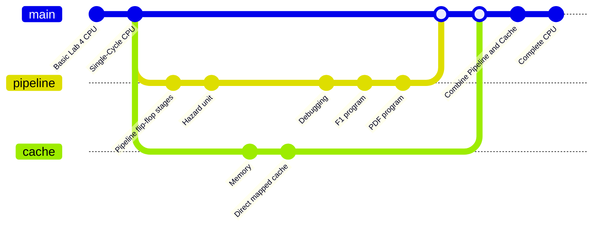

# RISC-V RV32I Processor

## Project Description
A pipelined RISC-V RV32I processor with set-associative data cache and hazard handling. 

## Team #4 Members

| Athanase de Germay de Cirfontaine (repo manager) | Radaan Kumar Madhan| Ivy Yu | Will Zhang |
|-|-|-|-|

## Team Contribution

- Work Contribution Table
- `/` refers to **minor contribution**
- `X` refers to **major contribution**

| Steps        | Files                         |Radaan (RadaanMadhan)| Will (will03216) | Ivy (Ivy-yu7) | Athanase (Wazab-75)|
| ------------ | ----------------------------- | ------------------ | ---------------- | ------------------------ | ---------------- |
| Lab 4        | Program Counter               |                    |                  |                          |                  |
|              | ALU                           |                    |                  |                          |                  |
|              | Register File                 |                    |                  |                          |                  |
|              | Instruction Memory            |                    |                  |                          |                  |
|              | Control Unit                  |                    |                  |                          |                  |
|              | Sign Extend                   |                    |                  |                          |                  |
|              | Testbench                     |                    |                  |                          |                  |
| Single Cycle | Data Memory                   |                    |                  |                          |                  |
|              | Program Counter               |                    |                  |                          |                  |
|              | ALU                           |                    |                  |                          |                  |
|              | Register File                 |                    |                  |                          |                  |
|              | Instruction Memory            |                    |                  |                          |                  |
|              | Control Unit                  |                    |                  |                          |                  |
|              | Sign Extend                   |                    |                  |                          |                  |
| Pipeline     | Pipeline flip-flop stages     |                    |                  |                          |                  |
|              | Hazard unit                   |                    |                  |                          |                  |
| Cache        | Memory                        |                    |                  |                          |                  |
|              | Direct mapped cache           |                    |                  |                          |                  |
|              | Two-way set associative cache |                    |                  |                          |                  |

## Project Progression

## Instructions Implemented
All RV32I Base Integer Instructions
| Type    | Instruction                   |
| --------| ----------------------------- | 
| R       | add, sub, xor, or, and        |               
| R       | sll, srl, sra, slt, sltu      |    
| I       | addi, subi, xori, ori, andi   |               
| I       | slli, srli, srai, slti, sltiu |           
| I       | lb, lh, lw, lbu, lhu          |                           
| S       | sb, sh, sw                    |     
| B       | beq, bne, blt, bge, bltu, begu|                                                 
| J       | jal                           |                                                 
| I       | jalr                          |     
| U       | lui, auipc                    |                                                                                             
| I       | ecall, ebreak                 |                                                                                             

## Parameter Specifications
| Parameter    | Value               |
| -------------| --------------------| 
| Instruction Memory    | a        |               
| Data Width ...
TBC...

## Other Files
| File Name   | Content               |
| ------------| --------------------| 
| README.md   |      |               
| .gitignore  |  |
TBC...

