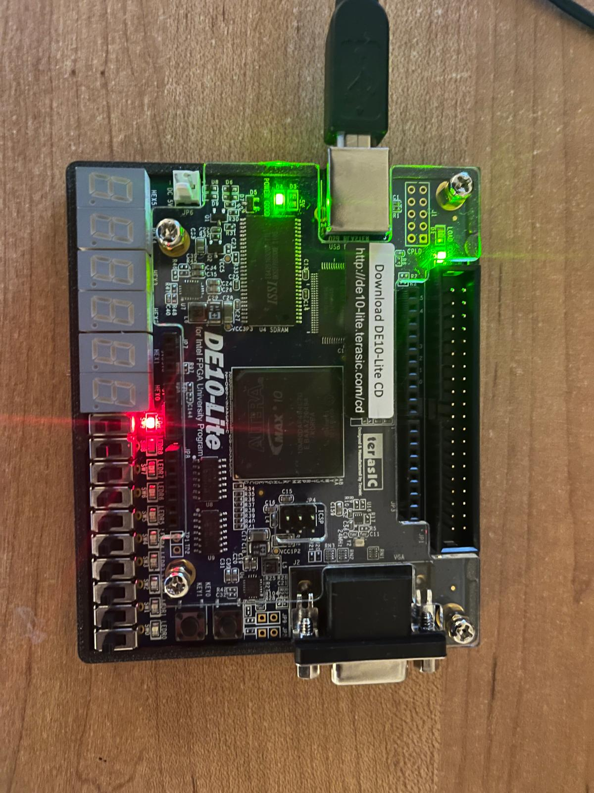

# RISC-V RV32I Processor

# FPGA

One of the extensions we did for this project was implementing the single cycle RISC-V CPU that we had designed onto a DE10 lite FPGA board. This proved to be a time consuming task because of certain constraints of the FPGA board. The differences were : 
 - The memory units in the FPGA had synchornous read which is different from the async read in the inst mem and data mem designed. 
 - The memory units only had a maximum of two output ports and thus storing data in byte addressed little endian was no longer viable

These differences required significant changes in the fetch and memory logic for the CPU to work. I changed the inst mem in fetch to be synchornous read and implemented the below logic 

```sv
logic [ADDRESS_WIDTH-1:0] pc_next;

always_comb begin
    if (jalr) pc = rs1 + ImmExt;
    else begin 
    if (PCSrc) pc = pc_cur + ImmExt - 4;
    else pc = pc_cur;
    end
    pc_next = pc + 4;
end


pc_reg pc_reg(
    .clk    (clk),
    .rst    (rst),
    .pc_next(pc_next),
    .pc     (pc_cur)
);
```  
The byte and half word write in data memory were slightly more complicated to implement. I was able to turn on the byte addressing option in the data mem which required a 4 bit byte address logic. Thus I implemented the following logic in data mem
```sv
    assign byte_address = addr[3:0];
    assign addr_w = addr >> 2;

    always_comb
        case (funct3) 
        3'b000: byte_address = 4'b0001;
        3'b001: byte_address = 4'b0011;
        3'b010: byte_address = 4'b1111;
        default: byte_address = 4'b0001;
        endcase
``` 
### Testing

Testing the model on the FPGA proved to be the most difficult challenge. This was because there was no easy way to see the result of each cycles execution as was the case with gtkwave and each time I modified the logic or changed the program file it was running, I had to recompile and sythesize the project which took between 15 - 30 minutes. I implemented the testing in a wrapper module with all the output ports necessary for the FPGA (DE10_lite_Golden_Top.v). The tests were set to turn on an led if the desired output was reached.

```sv
	top cpu_top (
		.clk		(MAX10_CLK1_50),
		.rst		(1'b0),
		.a0 		(a0)
	);
	assign LEDR[0] = ~KEY[0] | ~KEY[1];
	assign LEDR[1] = ~KEY[0];
	assign LEDR[2] = ~KEY[0];

	assign LEDR[9] =  (a0 == 32'hFE);

	assign HEX0 = 8'hFF;
	assign HEX1 = 8'hFF;
	assign HEX2 = 8'hFF;
	assign HEX3 = 8'hFF;
	assign HEX4 = 8'hFF;
	assign HEX5 = 8'hFF;
	
``` 
The below image implements the above test logic and shows that the test passes as pin 9 is turned on

<p align="center">  
      
</p>  

I was not able to run the reference test on the FPGA as the DE10_lite on-chip memory that I used had a maximum size of 64kb but the test requires 128kb. 