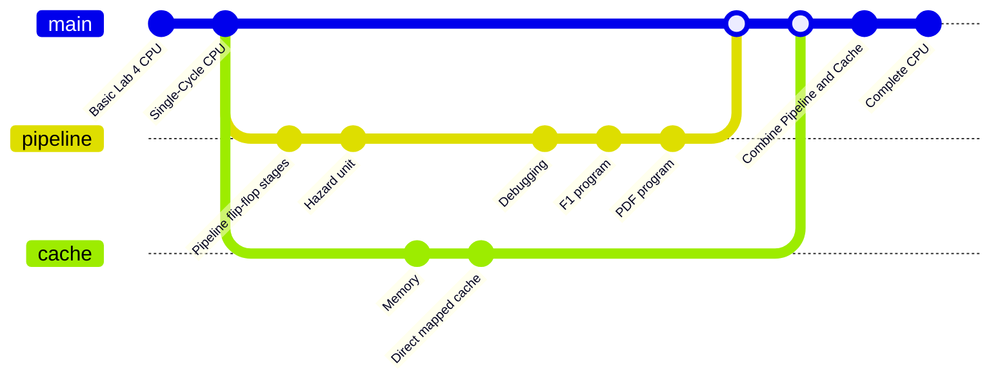

# RISC-V RV32I Processor

## Project Description
A RISC-V RV32I processor was implemented with cache and pipelining...

// small introduction to the project / the goal of the project

## Team #4 Members

| Athanase de Germay de Cirfontaine (repo manager) | Radaan Kumar Madhan| Ivy Yu | Will Zhang |
|-|-|-|-|

## Overview
- [Quick start](#quick-start)
- [CPU Design](#cpu-design)
  - [Instructions Implemented](#instructions-implemented)
  - [Parameter Specifications](#parameter-specifications)
  - [Work Evidence](#work-evidence)
- [Team Contribution](#team-contribution)
- [Project Progression](#project-progression)
- [Conclusion](#conclusion)

## Personal statement
- [Radaan Kumar Madhan](./doc/personal_statements/radaan_statement.md)
- [Ivy Yu](/doc/personal_statements/ivy_statement.md)
- [Will Zhang](/doc/personal_statements/will_statement.md)
- [Athanase de Germay de Cirfontaine](/doc/personal_statements/ata_statement.md)

## Quick start

// all the commands to execute the code / install the dependencies

## CPU Design

// small introduction to the different parts of the CPU / the instructions and the parameters

### Instructions Implemented
All RV32I Base Integer Instructions
| Type    | Instruction                   |
| --------| ----------------------------- | 
| R       | add, sub, xor, or, and        |               
| R       | sll, srl, sra, slt, sltu      |    
| I       | addi, subi, xori, ori, andi   |               
| I       | slli, srli, srai, slti, sltiu |           
| I       | lb, lh, lw, lbu, lhu          |                           
| S       | sb, sh, sw                    |     
| B       | beq, bne, blt, bge, bltu, begu|                                                 
| J       | jal                           |                                                 
| I       | jalr                          |     
| U       | lui, auipc                    |                                                                                          

### Parameter Specifications
| Parameter            | Value       |
|----------------------|-------------|
| Data Width           | 32 bits     |
| Instruction Memory   | 2^12 bits   |
| Instruction Width    | 32 bits     |
| Register File        | 32 * 32 bits|
| Data Memory          | 2^16 bits   |
| Cache Memory         | 4096 bytes  |
| Data Cache Block Size| 4 * 32 bits |
| Instruction Cache    | 516 bytes   |
| Pipeline Stages      | 5           |

### Work Evidence
// TODO: Add description and tests for the F1 program / sine / pdf

## Team Contribution

- Work Contribution Table
- `/` refers to **minor contribution**
- `X` refers to **major contribution**

| Steps        | Files  | Radaan (RadaanMadhan) | Will (will03216) | Ivy (Ivy-yu7) | Athanase (Wazab-75) |
| ------------ | ----------------------------------------------- | :----: | :--: | :-: | :------: |
| Lab 4        | [Program Counter](./repo/rtl/fetch/pc.sv)       |        |  X   |     |          |
|              | [ALU](./repo/rtl/execute/alu.sv)                |        |      |     |    X     |
|              | [Register File](./repo/rtl/decode/reg_module.sv)   |   /    |      |  /  |    X     |
|              | [Instruction Memory](./repo/rtl/memory/inst_mem.sv)  |   /    |      |  /  |          |
|              | [Control Unit](./repo/rtl/decode/control_unit.sv)    |   /    |      |  X   |    /     |
|              | [Sign Extend](./repo/rtl/decode/sign_extend.sv)     |        |      |  X  |          |
|              | [Testbench](./repo/tb_unit/tests/verify.cpp)               |   X    |   /  |  /  |    /     |
|              | [F1 program](./repo/rtl/F1/f1/f1_tb.cpp)             |        |  X   |     |          |
| Single Cycle | [Data Memory](./repo/rtl/memory/data_mem.sv)        |   X    |      |     |    X     |
|              | [Program Counter](./repo/rtl/fetch/pc.sv)       |        |  X    |     |          |
|              | [ALU](./repo/rtl/execute/alu.sv)                |        |      |     |    X     |
|              | [Register File](./repo/rtl/decode/reg_module.sv)   |   /    |      |     |          |
|              | [Instruction Memory](./repo/rtl/memory/inst_mem.sv)  |        |      |  X  |          |
|              | [Control Unit](./repo/rtl/decode/control_unit.sv)    |   /    |      |  X  |    /     |
|              | [Sign Extend](./repo/rtl/decode/sign_extend.sv)     |        |      |  X  |          |
|              | [Testbench](./repo/tb/tests/verify.cpp)       |   X    |   /  |  /  |    /     |
| Pipeline     | [Pipeline flip-flop stages]() |   X    |  X   |     |          |
|              | [Hazard unit]()    |   X    |  X   |     |          |
|              | [Prediction stage]() |   X    |   /  |     |          |
| Cache        | [Memory](./repo/rtl/memory/top_memory.sv)              |   /    |      |     |    X     |
|              | [Direct mapped cache]()  |        |      |     |    X     |
|              | [Two-way set associative cache]() |        |      |     |    X     |
|              | [Instruction Cache]() |        |      |  X  |          |
| Full CPU     | [Combine Pipeline and Cache]() |   X    |  X   |     |          |
|              | [F1 test on vbuddy](./repo/tb/f1/f1_tb.cpp)|        |   X   |     |       |
|              | [Ref test on vbuddy](./repo/tb/ref/ref_tb.cpp)|        |    X   |     |       |

## Project Progression

## File Structure

// TODO: Add the file structure of the repo

## Other Files
| File Name   | Content               |
| ------------| --------------------| 
| README.md   |      |               
| .gitignore  |  |
TBC...

## Conclusion

// TODO: Add the conclusion of the project
