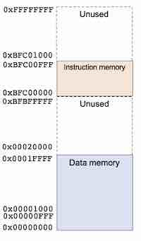

# RISC-V RV32I Processor

# Cache Memory

Building the main memory was not particularly challenging. However, implementing the cache memory required a significant amount of time and effort. The memory is divided into five parts:
- [data_mem.sv](/.repo/rtl/memory/data_mem.sv)
- [cache_mem.sv](./repo/rtl/memory/cache.sv)
- [top_memory.sv](./repo/rtl/memory/top_memory.sv)
- [inst_mem.sv](../../repo/rtl/fetch/inst_mem.sv)
- [inst_cache.sv](./repo/rtl/fetch/inst_cache.sv)

## 1) Data_mem.sv:  

The memory we are going to use will not occupy the full 2^32 bits, as Verilator will not support it, but also because it would be unnecessary for our use of the memory. We will then follow the structure given in the picture below:  

<p align="center">  
      
</p>  

We decided to separate the data and the instructions to simplify the cache memory implementation. The `data_mem` is constrained to read and store data between the addresses `0x00000000` and `0x0001FFFF`:  

```sv
logic [7:0] ram_array [32'h0001FFFF:0];
```  

Our main goal was to access the main memory as little as possible to reduce latency. Therefore, we implemented a write-back policy to update the cache memory only when the data is overwritten. Whenever the data is modified, the **dirty bit** = 1, and if it gets overwritten, the data is written back to the main memory.  

Additionally, the memory replaces the old data with four words of the called address. It is important to note that the data is byte-addressed and little-endian for greater flexibility.  

```sv	
ReadData = {ram_array[addr + 3], ram_array[addr + 2], ram_array[addr + 1], ram_array[addr]};
```  

## 2) Cache_mem.sv:  

This module is the most important part of the cache memory. Initially, we opted for a simple two-set cache memory with four blocks, as it was easier to test and debug. This version allowed us to manipulate data and have a first look at how the cache memory works and what could be done.  

  

The main variable that guides the cache module is the address received from the ALU. This address is then divided into four parts to identify the data stored in the cache:  

| Number of bits | Addr | Variable | Assignment |  
|----------------|------|----------|------------|  
| 21             | addr[31:11] | `TAG`        | Identifying data stored in memory |  
| 7              | addr[10:4]  | `INDEX`      | Index the cache storage in memory |  
| 2              | addr[3:2]   | `OFFSET`     | Select the word in the block |  
| 2              | addr[1:0]   | `BYTE OFFSET`| Byte addressing selection |  

This encryption allows the cache to identify the data stored but not maintain a stable memory. To make sure that we can exploit the cache without having to worry about the conflicts created with the main memory, two new signals are implemented:  

```sv
logic    v[NUM_SETS-1:0];
logic    d[NUM_SETS-1:0];
```  

Those two signals, `valid` and `dirty`, allow the cache to know if the data stored is valid and if it has been modified. This is important to avoid conflicts and ensure the data stored matches the main memory.  

---  

Once the two-set cache worked, we changed the structure to implement a 2-way set associative cache memory with 128 sets and 4 blocks per set. This provided a capacity of 4096 bytes.  

```sv
module cache #(
    parameter DATA_WIDTH = 32,
              BLOCK_SIZE = 4,    // 4 words per block
              WAYS       = 2,    // 2-way associative
              NUM_SETS   = 128 
)
```  

This module is divided into two parts:  
- The management of the cache memory (clocked at the positive edge)  
- The read output implementation (sent when data is requested)  

The first role of the cache is to decode the address and find the corresponding set and block. If the data is found in the cache, the signal `cache_read` returns the data selected by `func3` (**byte, half-word, or word**). If there is a miss, the cache sends a request to the main memory and stores the fetched data in its memory.  

The management of the cache memory follows these principles: If the data in the cache is correct, the valid bit is set to 1. If the data is modified, the dirty bit is set to 1. In case of a miss, a `fetch_enable` signal is sent to the memory to fetch the data. If the data corresponding to the same address in the cache is valid, the cache writes the data back to the main memory.  

```sv
output logic [4*DATA_WIDTH-1:0]  write_back_data,
output logic                     write_back_valid,
output logic [DATA_WIDTH-1:0]    write_back_addr


// Read miss
if (v[index][replace_way] && d[index][replace_way]) begin
    // Write back dirty block
    for (int i = 0; i < BLOCK_SIZE; i++)
        write_back_data[(i+1)*DATA_WIDTH-1 -: DATA_WIDTH] <= data_array[index][replace_way][i];

    write_back_addr  <= {tag_array[index][replace_way], index, 4'b0000};
    write_back_valid <= 1'b1;
end
```  

Instead of waiting for the `fetch_data` to be stored and then read again, we immediately send the data to the `top_memory` via the `read_cache` output. This reduces latency and the time needed to access the data.  


## 3) Cache for instruction memory: 
Cache is vital for enhancing performance by minimizing memory access latency and boosting overall system efficiency. I collaborated with a team member to design a CPU cache system, focusing on developing the cache for the instruction memory, finally integrating the instruction memory cache (cache_inst), the data memory cache (cache_data), along with their original non-cache parts (inst_mem and data_mem) into a top-level module (top_memory). 

```sv
module cache_inst #(
    parameter DATA_WIDTH = 32,
              BLOCK_SIZE = 4,
              WAYS       = 2,
              NUM_SETS   = 32
)(
    input  logic                     clk,               // Clock signal
    input  logic [DATA_WIDTH-1:0]    addr,              // Address for cache access
    input  logic [4*DATA_WIDTH-1:0]  fetch_data,        // Data fetched from memory
    input  logic                     fetch_enable,      // Fetch enable signal

    output logic [DATA_WIDTH-1:0]    cache_read,        // Data read from cache
    output logic                     hit,               // Cache hit indicator
    output logic [DATA_WIDTH-1:0]    fetch_addr,        // Address to fetch data from memory
    output logic                     fetch_request      // Fetch request signal
);
```

The cache_inst module is a parameterized, set-associative cache. It handles address decoding, hit detection, and cache read operations (writes are unnecessary since it is a ROM). 

The number of sets is configured to 32, representing a 75% reduction from the original instruction memory size. This value of num_sets balances hardware efficiency and performance. While fewer sets may increase cache misses, the design leverages spatial locality to maintain acceptable hit rates and reduces hardware resource usage and power consumption. 

The module takes an address as input, decomposing it into tag, index, and offset components for efficient lookup. It detects cache hits by comparing tags and valid bits, providing immediate access to data on a hit. In the event of a cache miss, the CPU fetches data from memory, updates the cache, and maintains valid and tag arrays for coherence. 