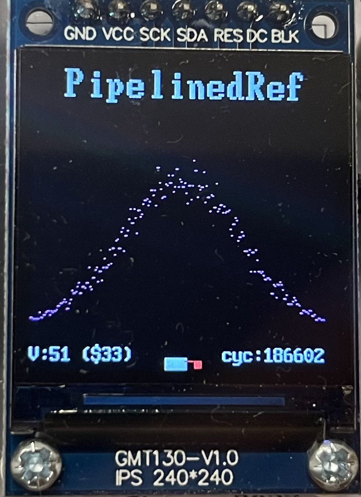
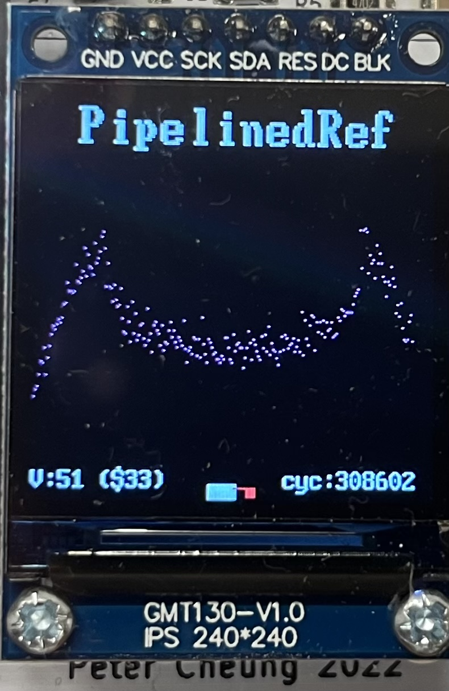
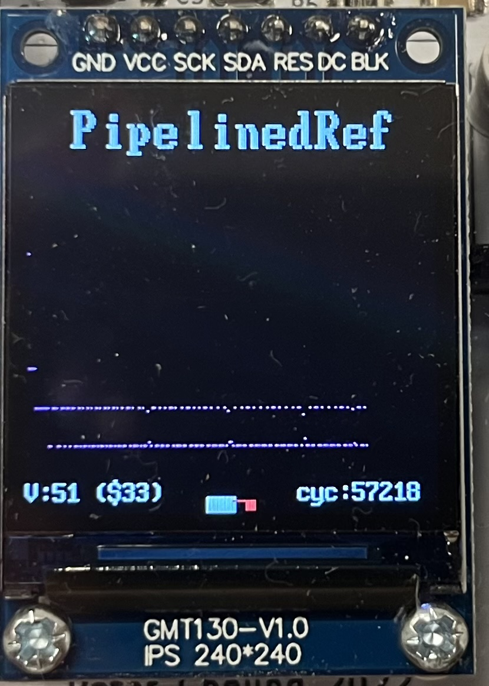
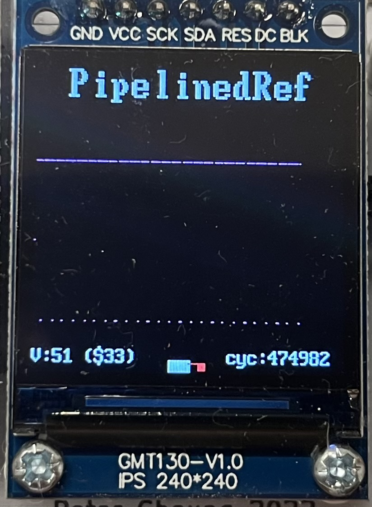
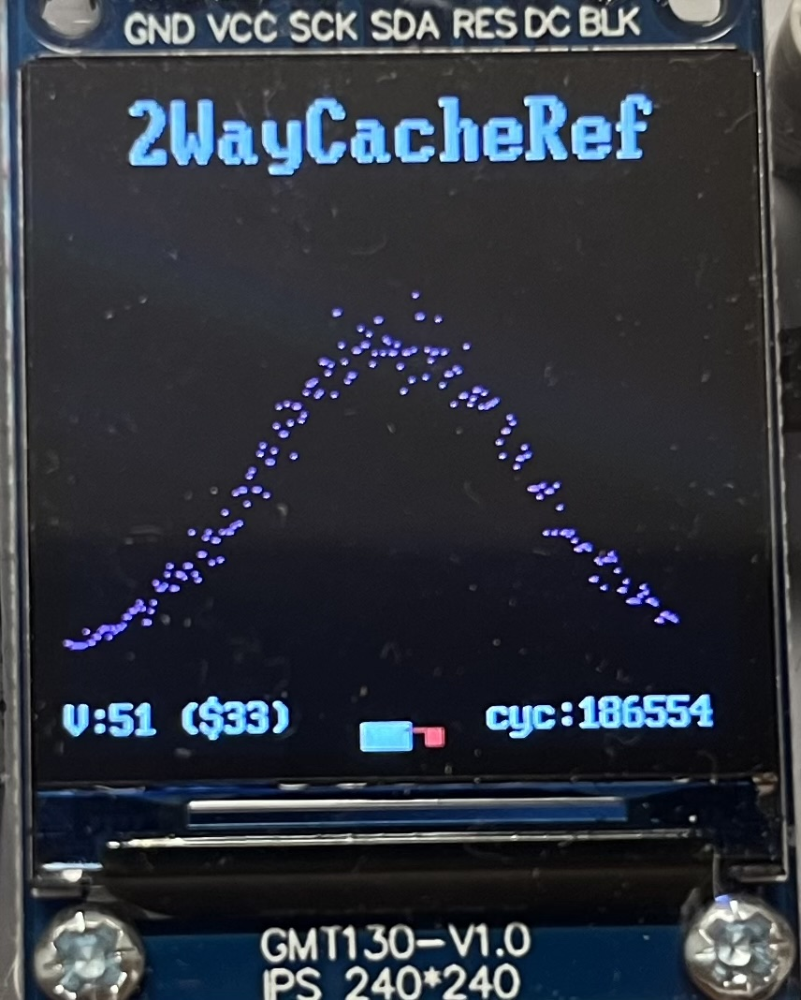
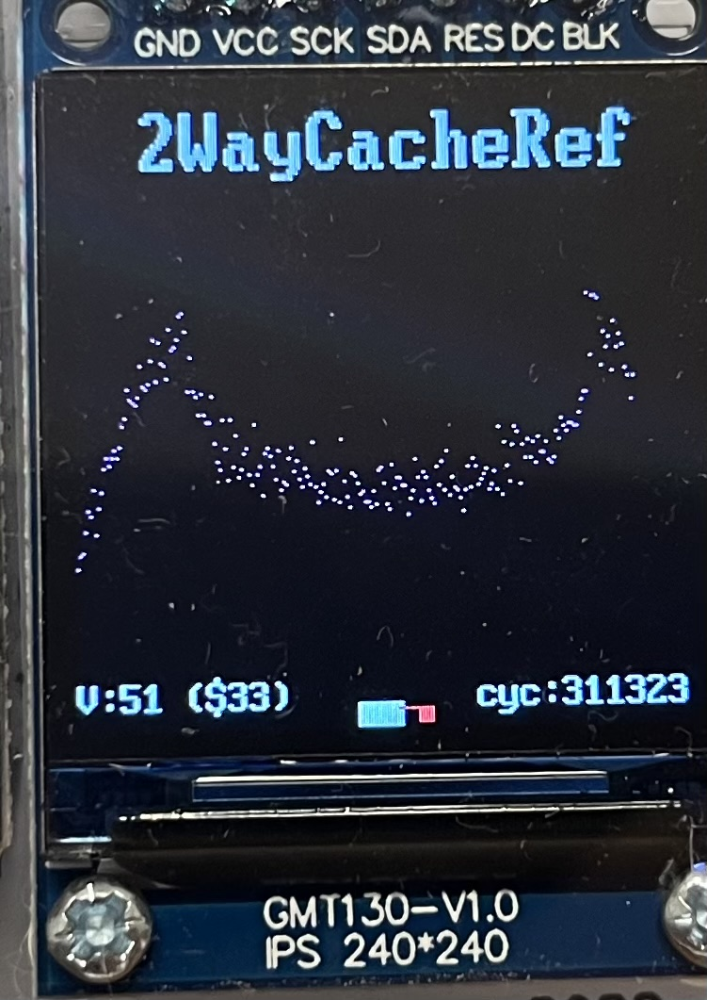
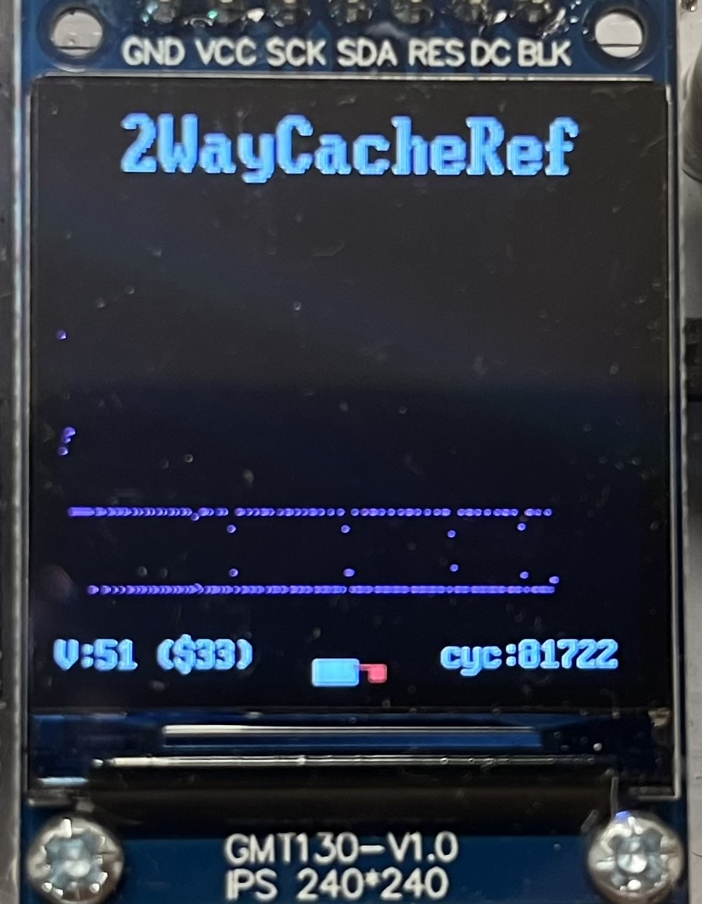
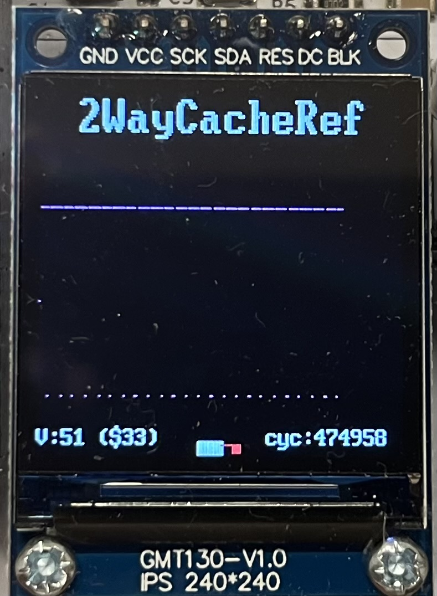

# RISC-V RV32I Processor

## Project Description
This project presents the design and implementation of a RISC-V32I processor with integrated caching and pipelining, undertaken by a team of four students to deepen our understanding of modern CPU architectures. Starting from a basic processor core, we gradually introduced pipelining stages to enhance performance and implemented caches to improve memory access efficiency. Each stage of development was carefully tested and validated, ensuring scalability. The final result is a fully functional, parameterizable RISC-V CPU capable of running various instructions and real-world programs, while also staying simple and clear enough to serve as a learning basis.

## Team #4 Members

| Athanase de Germay de Cirfontaine (repo manager) | Radaan Kumar Madhan| Ivy Yu | Will Zhang |
|-|-|-|-|

## Overview
- [Quick start](#quick-start)
- [CPU Design](#cpu-design)
  - [Instructions Implemented](#instructions-implemented)
  - [Parameter Specifications](#parameter-specifications)
  - [Work Evidence](#work-evidence)
- [Team Contribution](#team-contribution)
- [Project Progression](#project-progression)
- [Conclusion](#conclusion)

## Personal statement
- [Radaan Kumar Madhan](./doc/personal_statements/radaan_statement.md)
- [Ivy Yu](/doc/personal_statements/ivy_statement.md)
- [Will Zhang](/doc/personal_statements/will_statement.md)
- [Athanase de Germay de Cirfontaine](/doc/personal_statements/ata_statement.md)


## Quick start

### Windows
- Launch Ubuntu through WSL
- Clone this repository inside Ubuntu
- Open a terminal in the [tb](https://github.com/Wazab-75/RISC-V-Team4/tree/single_cycle/repo/tb) folder
- Run the following command in the terminal
```bash
./doit.sh
```

### MacOS
- Clone this repository
- Open a terminal in the [tb](https://github.com/Wazab-75/RISC-V-Team4/tree/single_cycle/repo/tb) folder
- Run the following command in the terminal
```bash
./doit.sh
```
### FPGA 
- Clone the [FPGA](https://github.com/Wazab-75/RISC-V-Team4/tree/FPGA) branch of this repository
- Open the project in [Quartus Prime Lite]()
- Compile the project (15 -20 min)
- Connect a DE10-lite FPGA board and click on start in Programmer

## CPU Design

The CPU architecture implemented in this project follows the RISC-V32I instruction set, and includes enhancements such as caching and pipelining. The design comprises several functional stages: fetch, decode, execute, memory, and write-back, that work together to process instructions in a streamlined manner. At its core, the CPU supports all base integer instructions of RV32I, which encompass arithmetic, logical, memory access, and control flow operations. Additionally, parameters like data width, memory size, and cache configurations are clearly defined and easily adjustable.

### Instructions Implemented
RV32I Base Integer Instructions:
| Type    | Instruction                   |
| --------| ----------------------------- | 
| R       | add, sub, xor, or, and        |               
| R       | sll, srl, sra, slt, sltu      |    
| I       | addi, subi, xori, ori, andi   |               
| I       | slli, srli, srai, slti, sltiu |           
| I       | lb, lh, lw, lbu, lhu          |                           
| S       | sb, sh, sw                    |     
| B       | beq, bne, blt, bge, bltu, begu|                                                 
| J       | jal                           |                                                 
| I       | jalr                          |     
| U       | lui,  auipc      |                                                                                          

### Parameter Specifications
| Parameter            | Value       |
|----------------------|-------------|
| Data Width           | 32 bits     |
| Instruction Memory   | 2^12 bits   |
| Instruction Width    | 32 bits     |
| Register File        | 32 * 32 bits|
| Data Memory          | 2^16 bits   |
| Cache Memory         | 4096 bytes  |
| Data Cache Block Size| 4 * 32 bits |
| Instruction Cache    | 516 bytes   |
| Pipeline Stages      | 5           |


### Work Evidence
#### F1 test
- F1 test result link: https://www.youtube.com/watch?v=6uR81nI1_iw  
- F1 pipelined test result link: https://www.youtube.com/watch?v=wtB4ZTANB38


### Reference test
#### Pipelined Test Results

| Gaussian                                                                                   | Noisy                                                                                     |
|--------------------------------------------------------------------------------------------|-------------------------------------------------------------------------------------------|
|             |            |
| **Sine**                                                                               | **Triangle**                                                                                |
|             |           |

<br>

#### 2-Way Associative Cache Test Results

| Gaussian                                                                                   | Noisy                                                                                     |
|--------------------------------------------------------------------------------------------|-------------------------------------------------------------------------------------------|
|             |            |
| **Sine**                                                                               | **Triangle**                                                                                |
|             |           |


## Team Contribution

- Work Contribution Table
- `/` refers to **minor contribution**
- `X` refers to **major contribution**

| Steps        | Files  | Radaan (RadaanMadhan) | Will (will03216) | Ivy (Ivy-yu7) | Athanase (Wazab-75) |
| Steps        | Files                                            | Radaan (RadaanMadhan) | Will (will03216) | Ivy (Ivy-yu7) | Athanase (Wazab-75) |
| ------------ | ------------------------------------------------ | :------------------: | :--------------: | :----------: | :----------------: |
| Lab 4        | [Program Counter](./repo/rtl/fetch/pc.sv)        |                      |        X         |              |                    |
|              | [ALU](./repo/rtl/execute/alu.sv)                 |                      |                  |              |          X         |
|              | [Register File](./repo/rtl/decode/reg_module.sv) |          /           |                  |      /       |          /         |
|              | [Instruction Memory](./repo/rtl/memory/inst_mem.sv) |          /           |                  |      /       |                    |
|              | [Control Unit](./repo/rtl/decode/control_unit.sv) |          /           |                  |      X       |          /         |
|              | [Sign Extend](./repo/rtl/decode/sign_extend.sv)  |                      |                  |      X       |                    |
|              | [Testbench](./repo/tb_unit/tests/verify.cpp)     |          X           |        /         |      /       |          /         |
|              | [F1 program](./repo/rtl/F1/f1/f1_tb.cpp)         |                      |        X         |              |                    |
| Single Cycle | [Data Memory](./repo/rtl/memory/data_mem.sv)     |          X           |                  |              |          X         |
|              | [Program Counter](./repo/rtl/fetch/pc.sv)        |                      |        X         |              |                    |
|              | [ALU](./repo/rtl/execute/alu.sv)                 |                      |                  |              |          X         |
|              | [Register File](./repo/rtl/decode/reg_module.sv) |          /           |                  |              |                    |
|              | [Instruction Memory](./repo/rtl/memory/inst_mem.sv) |                      |                  |      X       |                    |
|              | [Control Unit](./repo/rtl/decode/control_unit.sv) |          /           |                  |      X       |          /         |
|              | [Sign Extend](./repo/rtl/decode/sign_extend.sv)  |                      |                  |      X       |                    |
|              | [Testbench](./repo/tb/tests/verify.cpp)          |          X           |        /         |      /       |          /         |
| Pipeline     | [Pipeline flip-flop stages]()                    |          X           |        X         |              |                    |
|              | [Hazard unit]()                                  |          X           |        X         |              |                    |
|              | [Prediction stage]()                             |          X           |        /         |              |                    |
| Cache        | [Memory](./repo/rtl/memory/top_memory.sv)        |          /           |                  |              |          X         |
|              | [Direct mapped cache]()                          |                      |                  |              |          X         |
|              | [Two-way set associative cache]()                |                      |                  |              |          X         |
|              | [Instruction Cache]()                            |                      |                  |      X       |          X         |
| Full CPU     | [Combine Pipeline and Cache]()                   |          X           |        X         |              |          /         |
|              | [F1 test on vbuddy](./repo/tb/f1/f1_tb.cpp)      |                      |        X         |              |                    |
|              | [Ref test on vbuddy](./repo/tb/ref/ref_tb.cpp)   |                      |        X         |              |                    |


## Project Progression

## Branch Overview
This project includes five distinct branches:

1) Single-cycle (formerly main): Implements a single-cycle CPU with no cache or pipelining.
2) Pipeline: Introduces pipelining to the CPU.
3) Cache: Adds caching functionality to the CPU
4) Final: Combines both cache and pipelining for a fully functioning CPU.
5) RV32M: An additional CPU that computes multiplication MUL instructions. 

## File Structure
The repository is organized into several main directories and files reflecting the hierarchical structure of a RISC-V CPU design and its testing environment. The rtl directory holds SystemVerilog modules organized by function: decode, execute, fetch, and memory. Within F1, there are specialized files for a particular application test (e.g., f1.s), along with assembly and testbench configurations (f1_tb.cpp), demonstrating how the CPU integrates and executes a practical program. The tb and tb_unit directories host test files and frameworks, including assembly and C programs used for verification, scripts to compile and run these tests, and a range of testbench (.cpp) files targeting individual modules and full-system scenarios. This structure enables clear separation of design files from test resources, facilitating both incremental module-level testing and comprehensive system-level validation.

```
.
├── rtl
│   ├── F1
│   │   ├── RISC-V_assembly.sv
│   │   ├── f1
│   │   │   ├── doit.sh
│   │   │   ├── f1.s
│   │   │   ├── f1_tb.cpp
│   │   │   ├── vbuddy.cfg
│   │   │   └── vbuddy.cpp
│   │   └── riscvf1.sv
│   ├── decode
│   │   ├── control_unit.sv
│   │   ├── sign_extend.sv
│   │   └── top_decode.sv
│   ├── def.sv
│   ├── execute
│   │   ├── alu.sv
│   │   ├── reg_module.sv
│   │   └── top_execute.sv
│   ├── fetch
│   │   ├── pc.sv
│   │   └── top_fetch.sv
│   ├── memory
│   │   ├── data_mem.sv
│   │   ├── inst_mem.sv
│   │   └── top_memory.sv
│   ├── mux.sv
│   ├── top.sv
│   └── top_fetch.sv
├── tb
└── tb_unit
```


## Other Files
| File Name   | Content               |
| ------------| --------------------| 
| README.md   | Comprehensive overview of the project, including its implementation details, instructions supported, team contributions, project progression, and related documentation.   |               
| .gitignore  | This file specifies a list of generated files and directories, such as object files, binaries, and output logs, to be excluded from version control. |

## Conclusion

In conclusion, this project successfully demonstrates the design, implementation, and verification of a fully functional RISC-V RV32I processor enhanced with caching and pipelining. By partitioning the work among team members and incrementally building from a simple baseline CPU to a more complex, high-performance architecture, we gained a thorough understanding of both the theoretical foundations and practical challenges of hardware design.
 Throughout this process, our team also strengthened essential non-technical skills like clear communication, effective time management, and collaborative problem-solving. The project’s modular structure enabled us to divide tasks efficiently, support one another’s learning, and maintain a collective vision of our end goal. Ultimately, this combination of technical innovation and teamwork provided a valuable and rewarding educational experience, culminating in a CPU capable of executing a range of RV32I instructions and running real-world programs with robust reliability.


