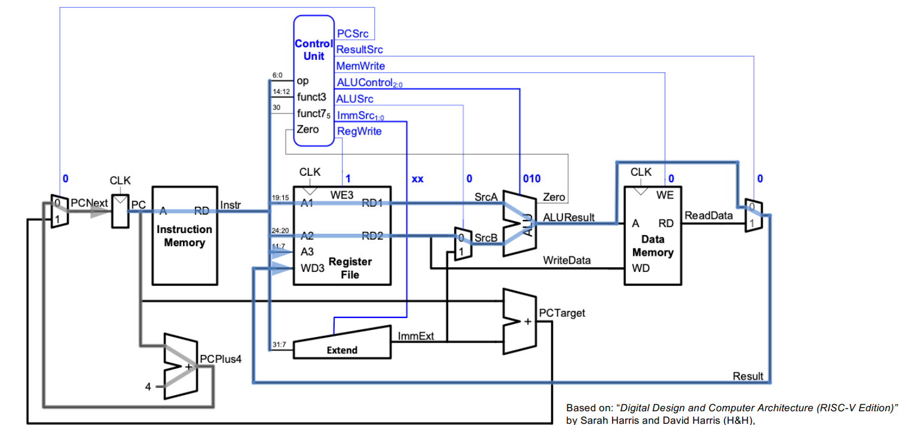
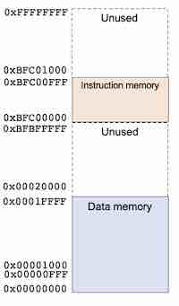
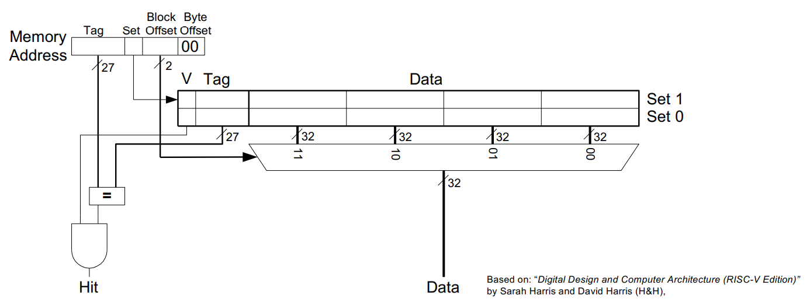

## Individual Personal Statement - Ata (Wazab_75)  
**Name:** Athanase de Germay de Cirfontaine  

**Role:** Repository Manager  

**CID:** 02490080  

## Overview  
- [Introduction](#introduction)  
- [Single Cycle CPU](#single-cycle-cpu)  
    - [ALU Execution Unit](#alu-execution-unit)  
    - [Cache Memory](#cache-memory)  
    - [Testing](#testing)  
- [Merge of Cache and Pipeline](#merge-of-cache-and-pipeline)  
- [Challenges](#challenges)  
- [Learning Outcomes](#learning-outcomes)  
- [Conclusion](#conclusion)  

## Introduction  
During this project, I have been mainly working on the single-cycle CPU, building the ALU execution unit and the cache memory. I have contributed to the design of:  
- The ALU execution unit (single-cycle)  
- Simple 2-set Cache Memory  
- Two-way Set Associative Cache Memory  

Once the cache design was completed, I then worked on the merge of the cache and pipeline implementation to create a fully functional CPU.  

This document will provide an overview of the work I have done, the challenges encountered, and the learning outcomes.  

## Single Cycle CPU  

The single-cycle CPU was initially divided into four major components:  
- `Fetch` (PC and Instruction Memory)  
- `Decode` (Control Unit)  
- `Execute` (ALU Execution Unit / Registers)  
- `Memory` (Cache Memory)  

  

We also wanted to keep the `top.sv` file clean and easy to read. Therefore, we created a module for each component. This allowed us to debug and test each module separately.  

### ALU Execution Unit  

Relevant commits:  
- [ALU Optimization Commit](https://github.com/Wazab-75/RISC-V-Team4/commit/ce6b6eb8ddd7d1232843c0a443dd6ad78447bea0)  

During the first part of the project, I worked on the ALU Execution Unit and the register files, which are part of the Execute stage. The ALU Execution Unit was designed to perform the following operations:  

```sv
 always_comb begin
    case (ALUctrl)
        3'b000:     ALUout = ALUop1 + ALUop2;            // ADD
        3'b001:     ALUout = ALUop1 - ALUop2;            // SUB
        3'b010:     ALUout = ALUop1 & ALUop2;            // AND
        3'b011:     ALUout = ALUop1 | ALUop2;            // OR
        3'b100:     ALUout = ALUop1 ^ ALUop2;            // XOR

        3'b101:     ALUout = ($signed(ALUop1) < $signed(ALUop2)) ? 1 : 0;  // SLT
    endcase
    EQ = (ALUout == 0) ? 1 : 0;                       // BNE
end
```  

For the purpose of lab4, these instructions were largely sufficient to perform the operations. Later on, I expanded the ALU to include shift and jump instructions. Additionally, we extended the width of the `ALUctrl` to include all the different instructions.  

```sv
case (ALUctrl)
    `ALU_OPCODE_LUI:     ALUout = ALUop2;
    `ALU_OPCODE_SLL:     ALUout = ALUop1 << ALUop2;
    `ALU_OPCODE_SRL:     ALUout = ALUop1 >> ALUop2;
    `ALU_OPCODE_SRA:     ALUout = ALUop1 >>> ALUop2;
endcase
```  

To make the modules more readable, we also created a `def.sv` module to define the different instructions. This helped us modify the instructions and avoid any conflicts, **e.g., ALU_OPCODE...**  

Finally, I added the 32-bit register module to complete the ALU execution unit.  

### Cache Memory  

Building the main memory was not particularly challenging. However, implementing the cache memory required a significant amount of time and effort. The memory is divided into four parts:  
- [data_mem.sv](../../repo/rtl/memory/data_mem.sv)  
- [cache_mem.sv](../../repo/rtl/memory/cache_mem.sv)  
- [top_memory.sv](../../repo/rtl/memory/top_memory.sv)  
- [inst_mem.sv](../../repo/rtl/memory/inst_mem.sv)  

#### 1) Data_mem.sv:  

The memory we are going to use will not occupy the full 2^32 bits, as Verilator will not support it, but also because it would be unnecessary for our use of the memory. We will then follow the structure given in the picture below:  

<p align="center">  
      
</p>  

We decided to separate the data and the instructions to simplify the cache memory implementation. The `data_mem` is constrained to read and store data between the addresses `0x00000000` and `0x0001FFFF`:  

```sv
logic [7:0] ram_array [32'h0001FFFF:0];
```  

Our main goal was to access the main memory as little as possible to reduce latency. Therefore, we implemented a write-back policy to update the cache memory only when the data is overwritten. Whenever the data is modified, the **dirty bit** = 1, and if it gets overwritten, the data is written back to the main memory.  

Additionally, the memory replaces the old data with four words of the called address. It is important to note that the data is byte-addressed and little-endian for greater flexibility.  

```sv	
ReadData = {ram_array[addr + 3], ram_array[addr + 2], ram_array[addr + 1], ram_array[addr]};
```  

#### 2) Cache_mem.sv:  

This module is the most important part of the cache memory. Initially, we opted for a simple two-set cache memory with four blocks, as it was easier to test and debug. This version allowed us to manipulate data and have a first look at how the cache memory works and what could be done.  

  

The main variable that guides the cache module is the address received from the ALU. This address is then divided into four parts to identify the data stored in the cache:  

| Number of bits | Addr | Variable | Assignment |  
|----------------|------|----------|------------|  
| 21             | addr[31:11] | `TAG`        | Identifying data stored in memory |  
| 7              | addr[10:4]  | `INDEX`      | Index the cache storage in memory |  
| 2              | addr[3:2]   | `OFFSET`     | Select the word in the block |  
| 2              | addr[1:0]   | `BYTE OFFSET`| Byte addressing selection |  

This encryption allows the cache to identify the data stored but not maintain a stable memory. To make sure that we can exploit the cache without having to worry about the conflicts created with the main memory, two new signals are implemented:  

```sv
logic    v[NUM_SETS-1:0];
logic    d[NUM_SETS-1:0];
```  

Those two signals, `valid` and `dirty`, allow the cache to know if the data stored is valid and if it has been modified. This is important to avoid conflicts and ensure the data stored matches the main memory.  

---  

Once the two-set cache worked, we changed the structure to implement a 2-way set associative cache memory with 128 sets and 4 blocks per set. This provided a capacity of 4096 bytes.  

```sv
module cache #(
    parameter DATA_WIDTH = 32,
              BLOCK_SIZE = 4,    // 4 words per block
              WAYS       = 2,    // 2-way associative
              NUM_SETS   = 128 
)
```  

This module is divided into two parts:  
- The management of the cache memory (clocked at the positive edge)  
- The read output implementation (sent when data is requested)  

The first role of the cache is to decode the address and find the corresponding set and block. If the data is found in the cache, the signal `cache_read` returns the data selected by `func3` (**byte, half-word, or word**). If there is a miss, the cache sends a request to the main memory and stores the fetched data in its memory.  

The management of the cache memory follows these principles: If the data in the cache is correct, the valid bit is set to 1. If the data is modified, the dirty bit is set to 1. In case of a miss, a `fetch_enable` signal is sent to the memory to fetch the data. If the data corresponding to the same address in the cache is valid, the cache writes the data back to the main memory.  

```sv
output logic [4*DATA_WIDTH-1:0]  write_back_data,
output logic                     write_back_valid,
output logic [DATA_WIDTH-1:0]    write_back_addr


// Read miss
if (v[index][replace_way] && d[index][replace_way]) begin
    // Write back dirty block
    for (int i = 0; i < BLOCK_SIZE; i++)
        write_back_data[(i+1)*DATA_WIDTH-1 -: DATA_WIDTH] <= data_array[index][replace_way][i];

    write_back_addr  <= {tag_array[index][replace_way], index, 4'b0000};
    write_back_valid <= 1'b1;
end
```  

Instead of waiting for the `fetch_data` to be stored and then read again, we immediately send the data to the `top_memory` via the `read_cache` output. This reduces latency and the time needed to access the data.  

#### Relevant commits:  
- [2-set Cache Commit](https://github.com/Wazab-75/RISC-V-Team4/commit/61c879e98349d58a8ac151de5a6c098b6cf21ffb#diff-52bee97fad294c9147e8cc98e4a4e59f6c17979731b57ac4a3899755c9abee33)  
- [2-way Set-Associative Cache Commit](https://github.com/Wazab-75/RISC-V-Team4/commit/c9236c5e331d16947c3be5d0d1502ec874d8ab73)  


## Testing

Testing is, in general, the most important part of a project, as you need to ensure that every single possibility is taken into account. We thought that each module should be tested independently to avoid potential errors and save time. This is why, before using the provided testbench, we created our own testbenches to test the modules in [tb_unit](../../repo/tb_unit/).  

The testbench created for the cache consisted of five tests, three of which concerned most of the features already covered by the main memory to verify that nothing was corrupted. The last two tests focused on the cache memory's misses and hits.

Another important factor to take into consideration is the miss rate of the cache memory, which reflects the efficiency of our cache. This was tested using the PDF testbench, which provides a lot of different cases for the management of the cache. After doing some tests, we got a **miss-rate = 2.26%** for **around 3% of the memory size.** Even though this only reflects one test, it gives an overview of the time that could be saved with a physical design.

#### Relevant testbench:

- [top_memory_tb.cpp](https://github.com/Wazab-75/RISC-V-Team4/blob/cache/repo/tb_unit/tests/top_memory_tb.cpp)


## Merge of Cache and Pipeline

The merge of different modules is always technical because you need to have a global view of the project to make sure that each wire is not causing any conflicts. On top of that, you also need to make sure that the two versions are up to date and that the cache memory is not causing any conflicts with the pipeline. Once the cache memory was tested and approved, we merged it with the pipeline to create a functional multi-cycle CPU.

## Challenges

During this project, my main challenge was managing the signals from cache memory to main memory and interpreting them consistently. At first, `data_mem` was little-endian and byte-addressed, while the cache memory was big-endian and word-addressed. This caused a lot of confusion and errors in the data transfer. The data going out was then reversed by bytes, which pushed us to simplify our design and apply little-endian formatting to all our memory components.

Another issue I encountered was managing the offset and byte offset. The address received via the ALU and then processed by the main memory was not always aligned with the data stored in the cache. The memory was then sending four words that should normally be stored in different sets to the cache. This caused a lot of confusion, as I was inspecting the signals and the wrong part of the data was processed. To make sure this issue would not persist, the addresses were filtered to remove their offset part and internally computed to filter the result and the data to send back:

```sv
// byte alignment code

logic [ADDRESS_WIDTH-1:0] aligned_addr;
assign aligned_addr = mem_read_addr & 32'hFFFFFFF0;
```

## Learning Outcomes

In my opinion, the most important part of this project was the management of the project itself. All team members had to work together to ensure that the project evolved in the right direction. Instead of having one single way of doing things, each individual had to ensure their work could be easily integrated with the rest of the project. This is why creating modules like `def.sv` was so important: to preserve a structure and avoid conflicts.

The second most important part, outside of technical knowledge, was managing a Git repository. We are all exposed to this tool in our daily work, but we never truly take the time to learn its features and maintain a clean repository when working alone. This project was a great opportunity for me to avoid putting it off until later.

Finally, I learned a lot about the architecture of a CPU. Even though we learned about all these components in the course, it does not compare to the experience gained from implementing them yourself. Your understanding of the subject deepens as you have to fully comprehend the link between each wire and module.

## Conclusion

In conclusion, even if the cache is just a "toy-extension" in this project and it doesn't significantly change the program's execution time, it was important to understand how it works and how it is implemented. Learning the RISC-V architecture was a great opportunity, not only because it teaches us how a CPU works but also because this knowledge is very valuable in the industry and could be highly useful in the future.
