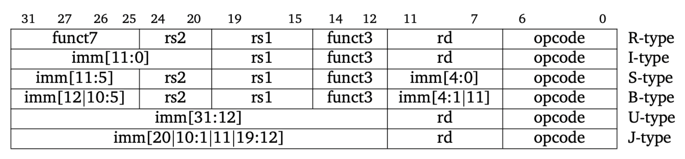

## Individual Personal Statement - Ivy 

**Name:** Ivy Yu

**CID:** 02379950

**Team:** Group 4

## Overview
- [Introduction](#introduction)
- [Single Cycle CPU](#single-cycle-cpu)
    - [Instruction Memory](#instruction-memory)
    - [Sign Extension](#sign-extension)
    - [Control Unit](#control-unit)
- [Cache for instruction memory](#cache-for-instruction-memory)
- [Conclusion](#conclusion)


## Introduction
In this project, my primary focus was on developing the 'decode' segment of the single-cycle CPU. This encompassed components such as the instruction memory, the sign extension module, and the control unit. Additionally, I contributed to the implementation of cache, specifically by constructing the cache for the instruction memory.

This document offers a comprehensive technical overview of my contributions, accompanied by reflections and insights gained throughout the process. This project enhanced my understanding of instruction architecture, CPU design, and SystemVerilog. Collaborating within a team of four was an incredibly rewarding experience: it was a supportive environment where ideas were exchanged and problems resolved collectively. I gained a deeper appreciation for the significance of communication and responsibility in successfully creating this CPU. 


## Single Cycle CPU

The implementation of the single-cycle CPU was divided into four sections: fetch, decode, execute, and memory. My contributions included working on part of the fetch section (instruction memory) and all of the decode section (Sign Extend and Control Unit). 


As illustrated in the schematic above, the address flows through the instruction memory, which outputs the instruction, serving as input to the control unit, register file, and sign extend modules. The sign extend module generates a sign-extended version of the immediate value based on the instruction type. Meanwhile, the control unit produces a set of logic signals that determine the operation of the execute stage of the CPU.

The following subsections provide a detailed explanation of each module, including the key design decisions made and challenges encountered throughout the process. 

### Instruction Memory

The inst_mem module implements a ROM-based instruction memory that outputs a 32-bit instruction for a given 32-bit address from the program counter. Instructions are loaded from a "program.hex" file, and four 8-bit blocks are concatenated to form the 32-bit output. It was initially challenging to ensure that the address input accurately indexed the ROM array while maintaining proper alignment for 32-bit instructions. 

The code snippet below demonstrates the creation of the ROM array, which is reduced to 2^8 = 256 locations, each 8 bits wide. The choice to implement a 256-location ROM array with an 8-bit width was made to ensure flexibility and efficient memory usage. Memory addressing was offset by 32'hBFC00000 to replicate a realistic memory-mapped ROM address range.
```sv
    logic [7:0] rom_array [32'hBFC00FFF : 32'hBFC00000];  
```

The following code shows the concatenation of 4 consecutive 8-bit blocks to form a 32-bit instruction. A combinational block (always_comb) was utilized instead of sequential logic to enable faster instruction fetching, aligning with the simplicity and speed priorities of single-cycle CPU design.
```sv
    always_comb begin
        dout = {rom_array[(addr + 3)- 32'hBFC00000],rom_array[(addr + 2) - 32'hBFC00000],rom_array[(addr+ 1) - 32'hBFC00000],rom_array[(addr) - 32'hBFC00000]};
    end
```

##### Relevant Commits:
- TODO


### Sign Extension:
This sign extend module takes an immediate value (Imm_in) and outputs a 32-bit sign-extended immediate (ImmExt). Depending on the instruction type (I-type, S-type, B-type, U-type, or J-type), specified by the 3-bit logic input ImmSrc, the module selects and extends the appropriate bits from Imm_in to construct the immediate value. A case statement is used to map the ImmSrc to the corresponding immediate type, making the design concise and readable while reducing the chances of errors in interpreting the instruction format.



```sv
    case (ImmSrc)
        3'b000: ImmExt = {{20{Imm_in[31]}}, Imm_in[31:20]};             // I-type
        3'b001: ImmExt = {{20{Imm_in[31]}}, Imm_in[31:25], Imm_in[11:7]};   // S-type  
        3'b010: ImmExt = {{20{Imm_in[31]}}, Imm_in[7], Imm_in[30:25], Imm_in[11:8], 1'b0};   // B-type  
        3'b011: ImmExt = {Imm_in[31:12], 12'b0};   // U-type  
        3'b100: ImmExt = {{12{Imm_in[31]}}, Imm_in[19:12], Imm_in[20], Imm_in[30:21], 1'b0};   // J-type  
        default: ImmExt = 32'b0;
        // R-type has no immediate
    endcase
```
The main challenge was correctly interpreting and extracting the relevant bit fields for each instruction type. This required a detailed understanding of how the immediate values are encoded in the RISC-V instruction set. Furthermore, I improved my debugging ability as I utilised testbenches to validate the correctness of my module. 

##### Relevant Commits:
- TODO

### Control unit:
Developing the control unit was my most significant contribution to the project, where I implemented all RV32I Base Integer Instructions. The control_unit module serves as the backbone of the RISC-V CPU, decoding 32-bit instructions to produce the control signals necessary for various instruction types. It processes the 32-bit instruction input (Instr) and the zero logic input (Zero) to output control signals including RegWrite, ALUctrl, ALUSrc, MemWrite, ImmSrc, and PCSrc, enabling coordination between each module within the CPU. By extracting key fields such as rs1, rs2, rd, funct3, and funct7, the module employs case-based logic to handle R-type, I-type, S-type, B-type, U-type, and J-type instructions. Additionally, it manages branching and jumping operations by calculating the target program counter (PCSrc) based on the Zero flag and the branch type.

| Type    | Instruction                   |
| --------| ----------------------------- | 
| R       | add, sub, xor, or, and        |               
| R       | sll, srl, sra, slt, sltu      |    
| I       | addi, subi, xori, ori, andi   |               
| I       | slli, srli, srai, slti, sltiu |           
| I       | lb, lh, lw, lbu, lhu          |                           
| S       | sb, sh, sw                    |     
| B       | beq, bne, blt, bge, bltu, begu|                                                 
| J       | jal                           |                                                 
| I       | jalr                          |     
| U       | lui, auipc                    |                                                                                             
| I       | ecall, ebreak                 |    

```sv
module control_unit (   
    input logic [31:0]  Instr,
    input logic         Zero,

    output logic        RegWrite,   
    output logic [3:0]  ALUctrl,    
    output logic        ALUSrc,     
    output logic [2:0]  ImmSrc,     
    output logic        PCSrc,       
    output logic        MemWrite,
    output logic [1:0]  ResultSrc,
    output logic [4:0]  rs1,
    output logic [4:0]  rs2,
    output logic [4:0]  rd,
    output logic        PcOp
);
```

One challenge I faced was implementing the large number of instructions and complex logic while maintaining a clean and readable design. I utilized case statements to organize and differentiate between various instructions, determining their respective outputs and how they interact with the ALU and program counter (PC). By using nested case statements and adopting better syntax, I made the implementation more concise.

 Developing this module deepened my understanding of the CPU's capabilities and the types of instructions it can execute. Additionally, I understood better how the modules coalesce to form a working CPU, which has furthered my interest for instruction architecture. For instance, the MemWrite output connects to the data memory module as a write-enable signal, which is set to 1 only for S-type (store) instructions, ensuring data is stored in memory.

 ```sv
    case (op) 
    // S-type
        7'b0100011: begin   
                    RegWrite = 0;
                    ALUctrl = 4'b0000;
                    ALUSrc = 1;
                    ImmSrc = 3'b001;
                    Branch = 0;
                    MemWrite = 1;
                    ResultSrc= 0;
                end
        ...
```

Building the control unit was a rewarding experience that allowed me to improve my SystemVerilog skills. Interpreting RISC-V instruction formats and extracting fields like rs1, rs2, rd, funct3, and funct7 was challenging, especially with the need to handle diverse instruction types like R-type, I-type, and J-type. However, it was incredibly satisfying to successfully design such a complex module and witness its contribution to the overall functionality of the CPU.

##### Relevant Commits:
- TODO


## Cache for instruction memory: 
Cache is vital for enhancing performance by minimizing memory access latency and boosting overall system efficiency. I collaborated with a team member to design a CPU cache system, focusing on developing the cache for the instruction memory, finally integrating the instruction memory cache (cache_inst), the data memory cache (cache_data), along with their original non-cache parts (inst_mem and data_mem) into a top-level module (top_memory). 

```sv
module cache_inst #(
    parameter DATA_WIDTH = 32,
              BLOCK_SIZE = 4,
              WAYS       = 2,
              NUM_SETS   = 32
)(
    input  logic                     clk,               // Clock signal
    input  logic [DATA_WIDTH-1:0]    addr,              // Address for cache access
    input  logic [4*DATA_WIDTH-1:0]  fetch_data,        // Data fetched from memory
    input  logic                     fetch_enable,      // Fetch enable signal

    output logic [DATA_WIDTH-1:0]    cache_read,        // Data read from cache
    output logic                     hit,               // Cache hit indicator
    output logic [DATA_WIDTH-1:0]    fetch_addr,        // Address to fetch data from memory
    output logic                     fetch_request      // Fetch request signal
);
```

The cache_inst module is a parameterized, set-associative cache. It handles address decoding, hit detection, and cache read operations (writes are unnecessary since it is a ROM). 

The number of sets is configured to 32, representing a 75% reduction from the original instruction memory size. This value of num_sets balances hardware efficiency and performance. While fewer sets may increase cache misses, the design leverages spatial locality to maintain acceptable hit rates and reduces hardware resource usage and power consumption. 

The module takes an address as input, decomposing it into tag, index, and offset components for efficient lookup. It detects cache hits by comparing tags and valid bits, providing immediate access to data on a hit. In the event of a cache miss, the CPU fetches data from memory, updates the cache, and maintains valid and tag arrays for coherence. 

Writing the cache modules was a valuable experience that deepened my understanding of cache design and its integration into CPU architectures. It reinforced my understanding of concepts like spatial and temporal locality, which are fundamental to optimizing memory access patterns. 

A major obstacle I faced was managing the trade-offs between hardware complexity and performance. For instance, implementing a 2-way set-associative cache required balancing increased hardware resources for multiple tag comparisons against the benefit of reducing conflict misses. Integrating all the cache modules into a top-level design was a critical learning experience in modular design and testing. Debugging the interactions between modules, especially ensuring coherence and consistency in fetch operations, provided valuable insight into the intricacies of building a robust system. 

##### Relevant Commits:
- TODO


## Conclusion: 
- TODO