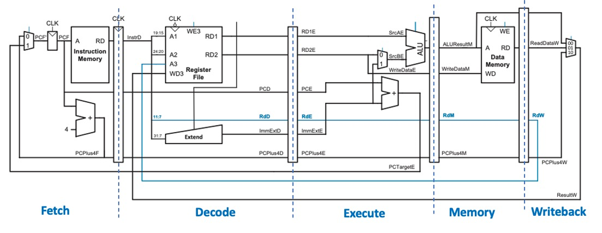
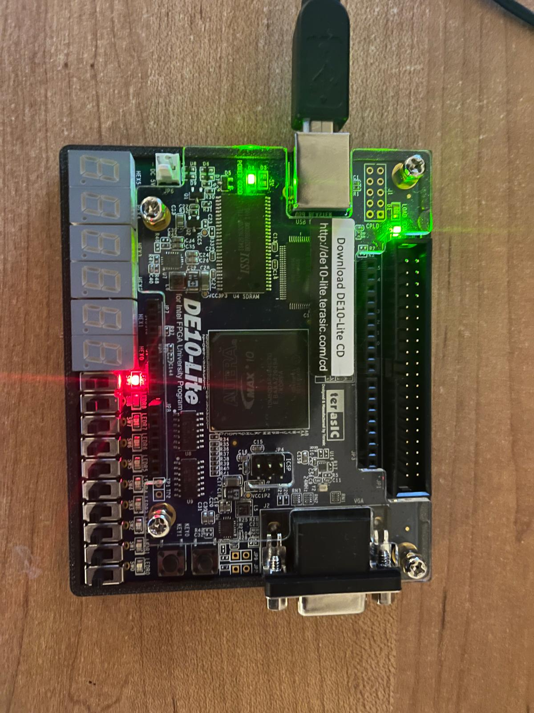

## Individual Personal Statement - Radaan (RadaanMadhan)  
**Name:** Radaan Kumar Madhan  

**CID:** 02389229   
 
## Introduction  
In this project I was in charge of integration, testing and correction of all the CPU modules. I have also worked on the pipelined CPU, built the data memory module and implemented the single cycle CPU onto the DE10 lite FPGA board. 

## Integration and Testing  

Relevant commits:  
- [All modules combined and corrected](https://github.com/Wazab-75/RISC-V-Team4/commit/393d45bc2c096a259825f7f15a70ccfb710381f4) 

All versions of the CPU pass the five benchmark tests that were given with no modifications of the assembly code. Integration involved testing the individual components in unit testbenches that I created and calling the modules in top.sv. Using the waveform file generated by Verilator, I was able to check the values of a wire at every clock cycle to verify the logic. 

The main challenge faced during this process was inconsistencies in logic between different modules that required me to change them to be compatable. 

### Data Memory Unit  

Relevant commits:  
- [Fix: Data Memory Access](https://github.com/Wazab-75/RISC-V-Team4/commit/57af398c29149247371fc12324c768c75eb47db5)  

The data memory unit was designed to be a RAM with synchornous write and asynchornous read. The data memory was required to implement byte, half and word (32 bits) addressing. To accomplish this each memory location stored 8 bits and the words were offset by 4 address spaces. Thus it was possible to write and read to the bytes in the words by addressing the four addresses in between. The type of addressing required was encoded in funct3 and the correct opperation was done for each of its cases.  

```sv
    case (funct3) 
        3'b000: ReadData = {{24{ram_array[addr][7]}}, ram_array[addr]};
        3'b001: ReadData = {{16{ram_array[addr+1][7]}}, ram_array[addr+ 1], ram_array[addr]};
        3'b010: ReadData = {ram_array[addr + 3], ram_array[addr + 2], ram_array[addr+ 1], ram_array[addr]};
        3'b100: ReadData = {24'b0, ram_array[addr]};
        3'b101: ReadData = {16'b0, ram_array[addr+ 1], ram_array[addr]};
        default: ReadData = {ram_array[addr + 3], ram_array[addr + 2], ram_array[addr+ 1], ram_array[addr]};
    endcase
```  


## Pipelined CPU

Relevant commits:  
- [Pipelined CPU with Hazard unit working](https://github.com/Wazab-75/RISC-V-Team4/commit/a87b52794d28d17fe36d6f2eaf6c3a5892929877)

Pipelining the CPU involved splitting the processes of the CPU into different cycles in hopes of being able to clock it faster and thus be more efficient. Our CPU is pipelined into 5 stages : 
- Fetch 
- Decode 
- Execute
- Memory 
- Write(register)

<p align="center">  
      
</p>  

Each stage passes its output to the next stage through a pipeline register and thus has an offset of one cycle in between stages. However to get the best performance from pipelining, the previous single cycle CPU structure had to be redesigned to have the correct modules in the correct stages. Execute pipeline register logic shown below. 

```sv
    execute_reg pipeline_execute(
        //input
        .clk         (clk),
        .MemWriteE   (MemWriteE),
        .ResultSrcE  (ResultSrcE),
        .PCPlus4E    (PCPlus4E),
        .RegWriteE   (RegWriteE),
        .RdE         (RdE),
        .ALUResultE  (ALUResult),
        .WriteDataE  (rd2_h),
        .funct3E     (instr_14_12E),

        //output
        .MemWriteM   (MemWriteM),
        .ResultSrcM  (ResultSrcM),
        .PCPlus4M    (PCPlus4M),
        .RegWriteM   (RegWriteM),
        .RdM         (RdM),
        .ALUResultM  (ALUResultM),
        .WriteDataM  (WriteDataM),
        .funct3M     (funct3M)
    );
```  
However these pipeline stages lead to control and data hazards that needed to be taken care of. This was implemented through the hazard unit. 


The main problems the hazard unit addressed were 
- Operations on registers that have not been written to yet 
- Branch operations leads to wrong instruction being fetched and decoded
- Load from memory instructions require one more cycle to fetch before they can be writtent to registers

These problems were addressed by the following logic
- Forward: If data that will be in register is in execute or memory stage, forward it to the input of execute stage. 
- Flush: If branch operation is taken, remove data in fetch and decode pipeline registers
- Stall: If data needs to be loaded from memory in the execute stage, stall the decode and fetch stage so that no instructions can access the register before it is loaded. 

```sv
    hazard_unit pipeline_hazard (
        //input
        .Rs1E           (rs1E),
        .Rs2E           (rs2E),
        .RdM            (RdM),
        .RdW            (RdW),
        .RegWriteM      (RegWriteM),
        .RegWriteW      (RegWriteW),
        .Rs1D           (instrD[19:15]),
        .Rs2D           (instrD[24:20]),
        .RdE            (RdE),
        .ResultSrcE     (ResultSrcE),
        .PCSrcE         (PCSrc),

        //output logic
        .ForwardAE      (ForwardAE),
        .ForwardBE      (ForwardBE),
        .StallF         (StallF),
        .StallD         (StallD),
        .FlushF         (FlushF),
        .FlushD         (FlushD)
    );
```  

By implementing this logic I was able to pass all of the given testbenches without any modifications to the assembly code.  However this model of the CPU took more cycles to execute the programs than the single cycle, which was expected. 


 ## FPGA

 Relevant commits:  
- [Single Cycle CPU implemented on FPGA](https://github.com/Wazab-75/RISC-V-Team4/commit/a87b52794d28d17fe36d6f2eaf6c3a5892929877)

One of the extensions I did for this project was implementing the single cycle RISC-V CPU that we had designed onto a DE10 lite FPGA board. This proved to be a time consuming task because of certain constraints of the FPGA board. The differences were : 
 - The memory units in the FPGA had synchornous read which is different from the async read in the inst mem and data mem designed. 
 - The memory units only had a maximum of two output ports and thus storing data in byte addressed little endian was no longer viable

These differences required significant changes in the fetch and memory logic for the CPU to work. I changed the inst mem in fetch to be synchornous read and implemented the below logic 

```sv
logic [ADDRESS_WIDTH-1:0] pc_next;

always_comb begin
    if (jalr) pc = rs1 + ImmExt;
    else begin 
    if (PCSrc) pc = pc_cur + ImmExt - 4;
    else pc = pc_cur;
    end
    pc_next = pc + 4;
end


pc_reg pc_reg(
    .clk    (clk),
    .rst    (rst),
    .pc_next(pc_next),
    .pc     (pc_cur)
);
```  
The byte and half word write in data memory were slightly more complicated to implement. I was able to turn on the byte addressing option in the data mem which required a 4 bit byte address logic. Thus I implemented the following logic in data mem
```sv
    assign byte_address = addr[3:0];
    assign addr_w = addr >> 2;

    always_comb
        case (funct3) 
        3'b000: byte_address = 4'b0001;
        3'b001: byte_address = 4'b0011;
        3'b010: byte_address = 4'b1111;
        default: byte_address = 4'b0001;
        endcase
``` 
### Testing

Testing the model on the FPGA proved to be the most difficult challenge. This was because there was no easy way to see the result of each cycles execution as was the case with gtkwave and each time I modified the logic or changed the program file it was running, I had to recompile and sythesize the project which took between 15 - 30 minutes. I implemented the testing in a wrapper module with all the output ports necessary for the FPGA (DE10_lite_Golden_Top.v). The tests were set to turn on an led if the desired output was reached.

```sv
	top cpu_top (
		.clk		(MAX10_CLK1_50),
		.rst		(1'b0),
		.a0 		(a0)
	);
	assign LEDR[0] = ~KEY[0] | ~KEY[1];
	assign LEDR[1] = ~KEY[0];
	assign LEDR[2] = ~KEY[0];

	assign LEDR[9] =  (a0 == 32'hFE);

	assign HEX0 = 8'hFF;
	assign HEX1 = 8'hFF;
	assign HEX2 = 8'hFF;
	assign HEX3 = 8'hFF;
	assign HEX4 = 8'hFF;
	assign HEX5 = 8'hFF;
	
``` 

<p align="center">  
      
</p>  

I was not able to run the reference test on the FPGA as the DE10_lite on-chip memory that I used had a maximum size of 64kb as the test requires 128kb. 


## Learning Outcomes

This project gave me deep insight into the implementation of a real CPU and challenges faced while doing it. Through synthesising onto the FPGA I was also able to see the hardware constraints that need to be taken into account while designing a CPU. For example: The clock of the FPGA can run at 50 Mhz but I ha to constrain it to 36.3 Mhz as any more will cause the setup time of the registers to be violated. This put into perspective the value of the pipelining as that will allow to me clock this CPU at max. I have also come to learn the challenges in working in a team for a coding project and importance of common design constraints to be defined vigorously before proceeding with implementation. 

## Conclusion

In conclusion, we were able to implement a functional RISC-V 32I CPU with pipeline and cache as well as synthesising the single-cycle version onto the FPGA. 
