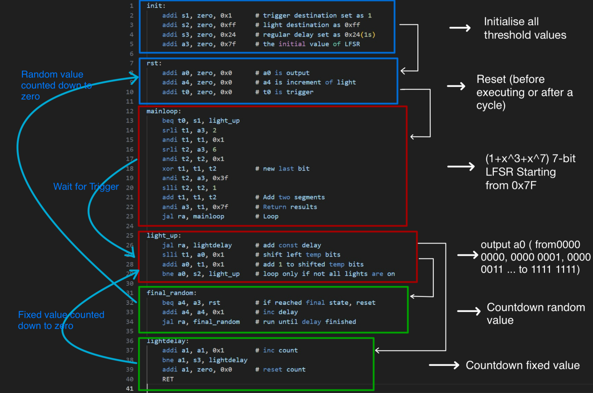
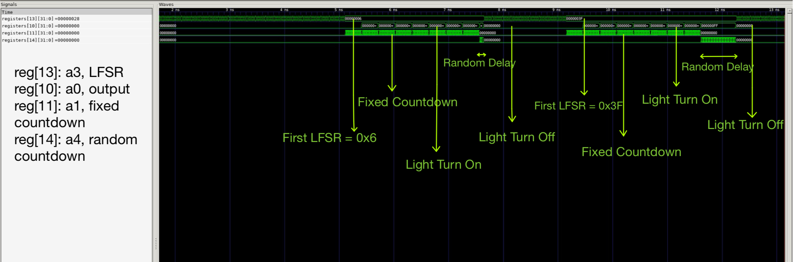
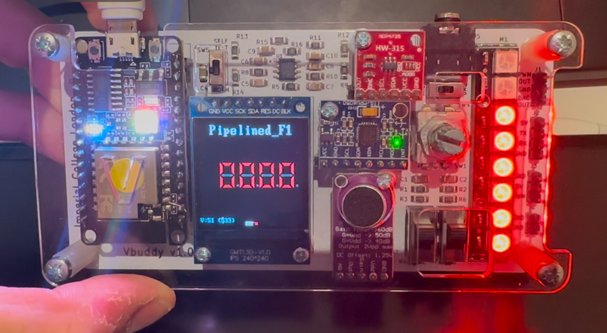

# Individual Personal Statement - will03216

## **Name:** Will Zhang
## **CID:** 02449358
## **Team:** Group 4

---

## Table of Contents
- [My Contributions](#my-contributions)
  - [Summary](#summary)
  - [PC Module](#pc-module)
  - [F1 Assembly Language Program](#f1-assembly-language-program)
  - [Pipelining](#Pipelining)
  - [Hazard Unit](#hazard-unit)
- [Mistakes I've made](#mistakes-ive-made)
  - [Over fragmentation in PC module](#over-fragmentation-in-pc-module)
  - [Random number generation](#random-number-generation)
  - [Missing trigger signal](#missing-trigger-signal)
  - [Wrong stages for pipeling](#wrong-stages-for-pipeling)
  - [Stall and Flush in pipelining](#stall-and-flush-in-pipelining)
  - [Forgot to check R0](#forgot-to-check-r0)
- [Special Design Decisions and test results](#special-design-decisions-and-test-results)
  - [Having a Top Module for Each Component](#having-a-top-module-for-each-component)
  - [Control Unit special design](#control-unit-special-design)
  - [Having testbench for each module](#having-testbench-for-each-module)
  - [F1 Test](#f1-test)
  - [Reference program Test](#reference-program-test)
- [What I've Learned in This Project](#what-ive-learned-in-this-project)
- [Future Improvements](#future-improvements)

----
## My Contributions
----
### Summary

My contributions focus on the PC module, F1 assembly code, Pipelining, Hazard Unit and Testing for F1 program & Reference program on Vbuddy. 

----

## PC Module

This module is central to controlling the program counter (PC) in the architecture. 

Relavent commits:  
[(pc, pc_offset, pc_plus)](https://github.com/Wazab-75/RISC-V-Team4/commit/8c1ce573b3525ea81437843441d0d7c55feaeac4)   
[(top_fetch)](https://github.com/Wazab-75/RISC-V-Team4/commit/3f54618bc80914849ec54bef322684e0c8965ac5)  
[(Pipelined top_fetch)](https://github.com/Wazab-75/RISC-V-Team4/commit/86b62ea433a95afa65ba4007fb18be94ae15f21f)  

  | Control Signal     | pc_next Value               | Description                           |  
  |--------------------|-----------------------------|---------------------------------------|  
  | `PCSrc = 0`        | `PCPlus4`    | Select next sequential address. |  
  | `PCSrc = 1`        | `PCTarget`    | Selects address for branch or jump. |  

**Inputs to note:**
  - `PCSrc`: I used control signal to select the next value of the `pc_next`. When there is a branch or jump instruction, it sets `PCSrc = 1`, which determines that next pc address is jump address or branch target address. When `branch_neg = 0`, it is applicable for `BEQ` instruction, where the branch condition is met only if `branch_l = 1` and `Branch = 1`. When `branch_neg = 1`, it is applicable for `BNE` instruction, where the branch condition is met only if `branch_l = 0` and `Branch = 1`. The logic is described as follows:
     ```
        PCSrc = (Branch && (branch_l ^ branch_neg)) || Jump;
     ```
  - `PCTarget`: I used `PcOp` to either select `rd1+ ImmExt`as target address for instruction like `JALR`, which `rd1` provides the base adress or `pc + ImmExt` for branch instructions. Thus, it determines the address of the instruction to be executed when the program performs a jump or branch.
     The logic is described as follows:
     ```
        PCTarget = PcOp ? rd1 + ImmExt : pc + ImmExt;
     ```
----

## F1 Assembly Language Program 

Relavent commits: [(F1 assembly code)](https://github.com/Wazab-75/RISC-V-Team4/commit/910c269408702408e590ea66611dbc0f67087b49)

In the F1 program, I designed an algorithm structured as **Initialisation - Generation Light Up - Countdown**.  The process is as follows:  

- In the `Init` section, vairables are established, including the fixed countdown number.
- During the `mainloop`, a 7-bit LFSR(initialized at 0x7F) is generated for random delay.
- In the `light_up` loop, the output register `a0` incrementally increases from `0000_0000` to `0000_0001`, and ultimately to `1111_1111`. Following each increment, the program enters the `lightdelay` loop to perform a fixed-number countdown.
- Upon completion of the countdown in `final_random`, the program returns to the `rst` section to reinitialize all values.

The algorithm is in the diagram below, with white straight lines illustrating unconditional jumps, and blue curves indicating conditional branches.  

 

## Pipelining

### Design Overview
 
Relavent commits:  [(stage 1)](https://github.com/Wazab-75/RISC-V-Team4/commit/2f40d28e483142c1f2874f173ea2cccefec8e4f4)  
                   [(stage1-4)](https://github.com/Wazab-75/RISC-V-Team4/commit/96ffd5c6b6bc747c2172525727c58e8843346c82)  
                   [(stage 3 fix signal)](https://github.com/Wazab-75/RISC-V-Team4/commit/ee5681859929cd281a1a41d5d49a9329f704e756)

Pipelining improves a processor's performance by allowing multiple instructions to overlap in execution. We divided the single-cycle processor into five stages, enabling simultaneous execution of different parts:
 
- **F**:  Fetch Instruction
- **D**:  Decode
- **E**:  Execute ALU
- **M**:  Memory Read and Write
- **W**:  Write Register

- ``Pipeline registers`` are used to separate each stage. Thus, I built registers for each pipeline, which stores the output of the current stage and serves as the input to the next stage and operates synchronously with the clock.

  - ``InstrD``, ``pc_next``, and ``PC_PlusD`` in ``Fetch_reg`` isolate fetch-stage data before passing it to the decode stage.
  - ``RegWriteE``, ``ALUctrlE``, and ``RD1E`` in ``Decode_reg`` isolate control signals and register data for the execute stage.

- ``Control signals`` (e.g. ``RegWrite``, ``MemWrite``) are generated in the decode stage and passed through the pipeline to ensure instruction execution in later stages. So, I propagate control signals by:

  - ``RegWriteE`` (Decode_reg → Execute_reg) and ``RegWriteM`` (Execute_reg → Memory_reg) ensure the write-back behavior is preserved.
  - ``ResultSrcE`` and ``ResultSrcM`` dictate the data source (ALU result, memory data, or PC).

----

## Hazard Unit

The hazard unit manages data and control hazards in a pipelined processor to ensure correct execution.  
Relavent commits: [(Hazard_unit)](https://github.com/Wazab-75/RISC-V-Team4/commit/3ca9f6109428770891904704436d2ea7ad8e9749)
  
Hazard unit deal with 3 situations that leads to error output in pipelined processor.
#### Forward logic

-  1. Data hazards are addressed by redirecting data from later pipeline stages to earlier ones. Instead of waiting for a result written back to a register, I desinged the logic which makes the result forward to where it's needed:

```SystemVerilog
if (((Rs1E == RdM) & RegWriteM) & (Rs1E != 0)) ForwardAE = 2'b10; // Forward from Memory_stage
else  if(((Rs1E == RdW) & RegWriteW) & (Rs1E != 0)) ForwardAE = 2'b01// Forward from Writeback_stage
else  ForwardAE = 2'b00; // No forwarding (use Register file output)

``` 
#### Stall logic

-  2. Another data hazard occurs when a subsequent instruction depends on data from a previous instruction that has not been produced yet. To support stalls, I wrote the logic below which when the current instruction is a Load instruction (indicated by`ResultSrcE0`) and the next instruction's source registers (`Rs1D or Rs2D`) depend on the destination register (`RdE`) of the Load instruction, then it sets the `lwStall` signal. This signal is then assigned to `StallF` and `StallD`, which are used to stall the Fetch and Decode stages in pipelining. This also explained why I added inputs `StallF` to the Fetch and Decode pipeline registers:

```SystemVerilog
  //stall
  assign lwStall = ResultSrcE0 & ((Rs1D == RdE)|(Rs2D == RdE)); 
  assign StallF = lwStall;
  assign StallD = lwStall;
```
#### Flush logic

-  3. Control hazards arise from branch instructions when the branch outcome is uncertain until the execution stage. I designed the logic below which when a branch or jump instruction is resolved (`PCSrcE` is high), the current instruction in the Decode stage becomes invalid and is cleared using `FlushD`. Similarly, when a data hazard occurs(`lwStall` is high) or a branch/jump occurs (`PCSrcE` is high), the instruction in the Execute stage becomes invalid and is cleared using `FlushE`. Thus, in pipeline control, I added inputs `FlushD` and `FlushE` signals to clear invalid instructions in the Decode and Execute stages.

```SystemVerilog
  //flush
  assign FlushD = PCSrcE;
  assign FlushE = lwStall | PCSrcE;
```

----

## Mistakes I've made

### Over-fragmentation in PC module

- In the initial design, the program counter (`pc_module`) was divided into overly granular components like `pc_plus` and `pc_mux`. While this approach clarified individual functionalities, it significantly complicated integration, making system connectivity cumbersome and less efficient.

### Random number generation

- In the F1 program, I initially adopted the algorithm from reference program which uses `load` and `store`to generate random numbers. I expect it to pre-generate all random numbers and storing them in the data memory. Thus, the program could map the `PC` value to a specific location in the data memory to read the random number. However, I found then `PC` would be a constant value at the point where a random number to be loaded.  In this case, this approach would transform the random number into a constant, which doesn't make sense. Finally, I designed a method which links to the way of pseudo-random number generation, which is **Before the `trigger` signal is asserted, the program iterates through a loop generating random numbers. Once `trigger` is asserted, a random number is generated.** In this way, no data being written to or read from the Data Memory.

### Missing trigger signal

- In the `regfile` module, I forgot to connect the trigger signal to register 5 (`registers[5]`), which results in no output on output register. This was found when I observe the test result from Gtkwave, there is always `0` in output (`registers[10]`). So, I added this line for representation of trigger signal in `reg_file`. Furthermore, In physical testing, the push-button switch on the Vbuddy functions as the `trigger`.

```
registers[5] <= {31'b0, Trigger};
```
```
top->trigger = vbdFlag();
```
### Wrong stages for pipelining

- In Pipelining design, since we restructured the cpu after single cycle processor,` Inst_mem` has to be in fetch stage and `reg_files` in decode stage. But I designed pipelining which matches to the old control unit. So, I mistaknly put `reg_files`  in fetch stage, which make the Fetch stage does not know the opcode and register addresses of the current instruction, so it cannot accurately read the registers. 

### Stall and Flush in pipelining

- I tried to use the input `clr` and `en` to achieve the function of `Stall` and `Flush` in pipeling. However, both the `rst` signal and the `clr` signal can reset the registers to zero, since I didn't clearly defined their priority, which led to confusion. Besides, the clearing logic of `clr` may override the holding logic of `en`. Later, We changed it to input `StallF` and `FlushF`, which makes sure that two signals do not interfere with each other.
```
    if (!StallF) begin
              if (FlushF) begin
                  instrD <= 0;
                  pcD <= 0;
                  PCPlus4D <= 0;
              end
```
### Forgot to check R0
- In data forwarding logic, I omitted to check for whether Rs1E is 0, which result in incorrect data forwarding. Specifically，when `Rs1E` is register 0 (R0), the logic might mistakenly trigger data forwarding, leading to invalid data being fetched from the Memory or Writeback stage. This invalid data could overwrite the correct value of the "zero register" (`which is always 0`), causing logical errors in the program.
```
      & (Rs1E != 0)
```
----
## Special Design Decisions and Test Results

### Having a Top Module for Each Component
- Each component, such as **PC** or **Control Unit**, has its functionality encapsulated in its own top module.
- Advantages: Modules focus on single tasks (e.g. PC updates program counter, Control Unit generates signals), making the design easier to understand and test. 
#### Top Fetch
 - In traditional instruction fetch stages, the address calculations for sequential execution and branch/jump operations are handled by separate units, namely `pc_plus` and `pc_offset`. So, I used **Top-Fetch module**, which combines their functionality into a single, streamlined design using a (`mux`).
 ```
    mux pc_sel(
        .in0    (PCPlus4),
        .in1    (PCTarget),
        .sel    (PCSrc),
        .out    (pc_next)
    );
 ```
### Control Unit special design
- We split the  **Control Unit** into **Main Decoder**, the **ALU Decoder**. The **Main Decoder** is responsible for decoding the opcode, generating basic global control signals such as register read/write, memory access, and branch signals, and passing ALU-related information to the **ALU Decoder**. The **ALU Decoder** further decodes the opcode and function code to generate signals that control the ALU operations. The top-level **Control Unit** integrates and coordinates the outputs of both decoders, ensuring collaboration between modules and fulfilling the requirements of the pipelined architecture.

### Having testbench for each module
-  We thought that we should test each module independently before integrating them to avoid potential errors. Thus, we created our own testbenches to test each module and eventually used the testbench provided to test the entire processor. [(tb_unit)](https://github.com/Wazab-75/RISC-V-Team4/tree/single_cycle/repo/tb_unit)

### F1 Test

Relavent commits: [(F1 test)](https://github.com/Wazab-75/RISC-V-Team4/commit/b752d419af375e09ed924028739c5aa43cee4f13)
- I made the testbench for F1 code on Vbuddy:
```
    // Initialize top Verilog instance
        Vtop *top = new Vtop;
    // a0 is the output from F1 assembly code
        vbdBar(top->a0 & 0xFF);
```  
- Manually tested result on Gtkwave:  

 


- Test result from Vbuddy

Single cycle F1:    Pipelined_F1: 

### Reference program Test
Relavent commits: [(ref test)](https://github.com/Wazab-75/RISC-V-Team4/commit/0ea127cc132fea0759bab6f9da350f1673b06c0e)

- I built a testbench for Reference Program on vbuddy.
- **Special designs 1**: When analyzing the reference code for the probability density function, I noticed an interesting behavior of `vbuddy`. The output `a0` becomes valid only after cleaning, building, and displaying data, meaning the initial output might be zero for multiple cycles. To improve efficiency, I optimized the `testbench` by plotting graphs only when `a0 = 1`, significantly reducing overhead.
```
  if (plot == 0 && top->a0 != 0) {
        plot = 1;
      }
```
- **Special designs 2**: The final loop generating the PDF graph often repeats itself. To resolve this, I added a maximum plotting limit in the `testbench`, ensuring only one complete and meaningful graph is displayed. This prevents redundant visual outputs, and the limit dynamically adjusts based on different memory contents.
```
      if (plot > 1920) {
        break;
      }
```
----
## What I've Learned in This Project

Through the process of building the processor during this project, I have gained a substantial practical understanding to RISC-V. This coursework has been instrumental in deepening my comprehension of the various modules within the CPU and their interrelations. I learned to use a lot of tools like **Git**, which is essential for version control and managing repository structure. I got more opportunities to write **SystemVerilog** language and use **Verilator**. Additionally, I am more familiar with sequential and combinational logic, and I learned how to use Gtest combined with test on Vbuddy to fully prove the functionality. If I have time, I would keep an detailed logbook which records what I did and how I did it, it also serves as a reference for reporting.

----
## Future Improvements

In future works, I would add more pipelining stages by spitting existing stages(`decode_reg, execute_reg`) into finer sub-stages, which allow higher clock speeds and make execution of inistructions faster. Secondly, I would have liked to work on the data cache and try to apply state machine on cache design. Futhermore, I am also eager to integrate multiple cores within the processor, allowing each core to execute tasks independently. To conclude, I enjoyed the time I spent working with my team on the project and I feel satisfied with what we achieved and learned from it.
